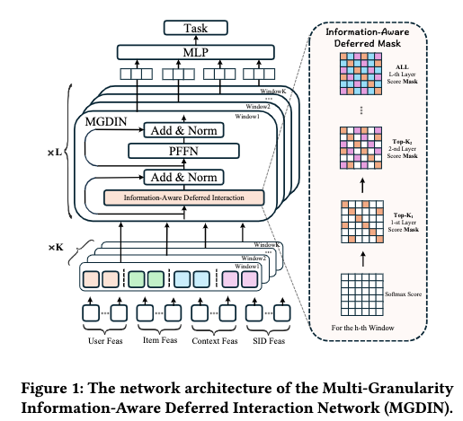

# 阿里，特征交叉新方法，CTR+3%

关注我，每天为你精挑细选最优质、最新鲜的推荐算法paper，陪你一起保持进步、不断精进！

### 论文：Deferred is Better: A Framework for Multi-Granularity Deferred Interaction of Heterogeneous Features
### 网址：https://arxiv.org/pdf/2603.12586
### 公司：阿里Lazada
### 思想：延迟交互
### 方向：特征交叉

## 解读：
本文提出了一种新的特征交叉的方法。
把所有特征同时喂入交互层的问题是，低信息量的稀疏特征会在早期引入大量噪声，淹没高质量特征的信号。反过来说，增加的一些高质量的特征在网络向前传播的过程中，特别是在特征交叉的过程中，被挤掉了。
本文的方法就是为了解决这个问题的，简单来说，就是不同信息密度的特征不应该在同一时刻参与交叉，稀疏特征应该被延迟引入。

### （1）特征分组
特征按信息量从高到低排好序，然后按照几种方案分组，每种分组方案**各自独立、并行**地进入后续的交互模块。
对于某一个分组方案，比如n组，每组内部用拼接合成一个组表征，那么就形成了一个序列长度n的向量序列。

**补充**：
信息量的定义论文没细说，可能的排序方式有很多种：统计频次、embedding范数、特征的cardinality、信息增益等等，每种都有道理，但论文一个都没提。逻辑链条是：一个特征越稀疏（比如某个冷门Item ID），它在训练数据中出现次数就越少，对应的embedding被训练的次数也越少，所以学到的表征质量就越差、噪声越大。反过来，像设备类型、用户年龄这种低基数或数值型特征，几乎每条样本都会出现，embedding被充分训练，表征质量高。

### （2）特征交互
每种分组方案分别做组间的特征交互，基本上就是Transformer的self-attention，获得一个表征。最后，将所有分组方案的表征拼接起来，经过一个MLP做预测，算交叉熵。

对于某一个分组方案，对应一个序列长度n的向量序列，做self-attention，获得同维度的序列。紧接着，残差连接、LayerNorm层、前馈网络、LayerNorm层等操作。经过这样的多个这样的模块的堆叠，获得一个表征。可见，与Transformer的区别是，没有对attention做softmax及相关操作。
残差连接在这里的具体意义是可以将该组特征往后传，在后续层里与其它特征组做特征交叉。这样，特征交互的时候，每个特征组不断融合其它组的信息，增强自身，实现了“无损”向前传播。

特别的，在做self-attention，计算attention的时候，加了一个Top-K的掩码，即只保留attention结果矩阵中所有元素的top-K大的attention，其它的attention设置为0。
注意，
* 每层的top-K的K值不同，越来越大，按照一个公式来的。
* 掩码，是根据第一层的attention计算的矩阵，后续所有层都复用它。**为什么不每层重新算？**因为随着网络加深，每组的表征已经融合了其他组的信息，分数就不再能反映"原始信息量"了。而第一层的表征最纯净，分数最能体现哪些组信息丰富（分高）、哪些组稀疏噪声大（分低）。

**A/B**：Lazada，3.04%的CTR相对提升。

**为什么这样做？**
可以从两个角度理解：
* 避免噪声传播。浅层是表征建立的关键阶段。如果稀疏特征在这个阶段就参与交互，它们欠训练的embedding会把噪声扩散到稠密特征的表征中，造成"劣币驱逐良币"。掩码把这个传播路径切断了。
* 先稳后扩。稠密特征先在浅层充分交互，建立起稳定、高质量的表征基底。到深层时，这个基底已经足够鲁棒，此时引入稀疏特征的噪声，模型有足够的"免疫力"去吸收有用信号、过滤噪声。

## 心得：
* 大模型来之前，特征交叉就没有完美解决，大模型来了，没有那么多人去做了，也没有那么大的兴趣做了，但是仍然有解决的必要，因为解决了也可以拿到成果。

## 可信度：生产

## 推荐等级：有实践价值

**请帮忙点赞、转发，谢谢。欢迎干货投稿 \ 论文宣传\ 合作交流**

### 【铁粉】请入微信群，群内我会给出更深入的解读，还可以共同讨论技术方案、发招聘广告、内推和交友等。
* 铁粉标准：关注公众号一个月以上，且在公众号上累计15次互动（评论、爱心、转发）、或投稿1次、或打赏199，只欢迎技术同学。
* 入群方法：请您加个人微信lmxhappy，我拉您入群，请备注【公司】（只我个人看，不公开）。

## 推荐您继续阅读：

