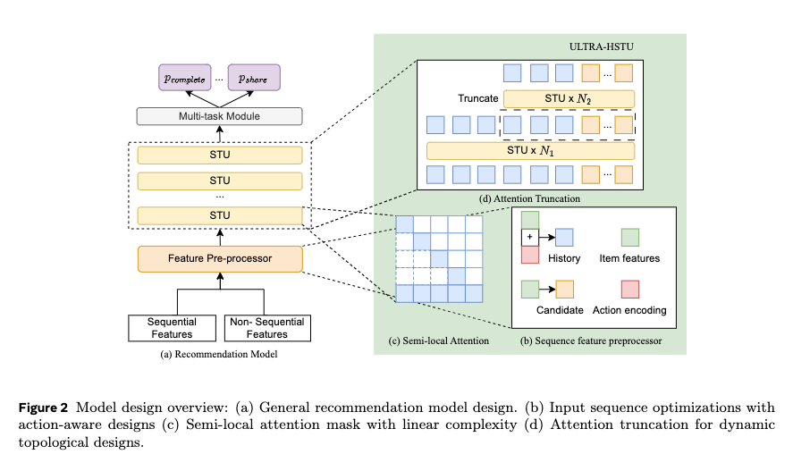

# Meta，HSTU 2.0 

关注我，每天为你精挑细选最优质、最新鲜的推荐算法paper，陪你一起保持进步、不断精进！

### 论文：Bending the Scaling Law Curve in Large-Scale Recommendation Systems
### 网址：https://arxiv.org/pdf/2602.16986
### 公司：Meta
### 思想：
### 方向：超长行为序列建模

## 解读：
本文是超长序列建模的方法。将用户特征 + 上下文特征 + 用户行为序列（UIH） + 多个候选物品（candidates） 统一组织成一个长 token 序列，然后通过多层 STU（Sequential Transduction Unit） 的堆叠（即自注意力层），让序列内的所有元素进行充分的交互与信息交换，最终直接生成每个 candidate 的多任务预测概率（点击、完播、分享、观看时长等）。

本文的手段都是为了增加建模的序列长度，包括：

### （1）输入序列优化
* 序列里，不再item和action的嵌入交替拼接，而是将两者加和，从而将序列长度直接减半。注意，用户历史序列是由新及久的排序的。
* 异构Action Encoding：每一个 Action Embedding 都变成了一个信息密度极高的向量，融合了“是什么行为 + 行为强度 + 当时的用户上下文”。
* Load-Balanced Stochastic Length (LBSL)：对每个用户序列，随机决定一个截断长度 k，然后只保留序列最前面的 k 个行为（即用户最最近的 k 次交互）。

### （2）重新设计self-attention的attention mask
提出了Semi-Local Attention (SLA)，即每个序列元素只attend少部分item，两部分——附近局部和最近全局。
* 附近局部：就是它前后的序列元素，长度为K1；
* 最近全局：就是用户最近的一段序列元素，长度为K2。
对其它的item不做attend，换句话说attention score为0。

### （3）混合精度
* 训练的时候，矩阵乘法运算，用FP8，其它的都用BF16。
* 推理的时候，embedding lookup用int4。把查好的embedding从主机内存传输到GPU的HBM显存，也用int4。

### （4） 定制算子
将原本多个算子，如量化、缩放、LayerNorm、矩阵乘法、矩阵加法等，通过定制合并为一个算子，从而省掉多次内存读写，提高计算效率。

### （5）降低显存占用
* 激活重计算：标准 Transformer 在 forward 时要保存大量中间激活（activation）用于 backward 计算，导致超长序列（16k）时显存爆炸。不保存下面 6 个最大的 forward tensor，在 backward 时重新计算这些 tensor，从而能够将超长序列存入到显存。
* Jagged Tensor：传统训练中，不同用户序列长度不同，必须 padding 到最大长度（比如全 padding 到 16k），浪费大量显存。全程使用 Jagged Tensor，真正做到变长序列不 padding，所有操作（Attention、GEMM、LayerNorm等）都支持jagged 格式。

### （6）金字塔堆叠
本文也像OneTrans那样，做了金字塔堆叠，目的和**OneTrans**一样：让后面层不需要处理超长序列，节省计算。但区别是：不是严格的“多层越来越短”（不是每层都缩短一点），而是两段式——前 N1 层全序列，后 N2 层只做最近一段高价值子序列。

### （7）序列拆分
消费序列和互动序列分别走独立 HSTU，再融合，让高价值信号不被稀释。也是为了减少计算量，从而包含更多更久的序列。

### 除此之外，本文的洞见：
* 自注意力仍然优于 Cross-Attention，尤其在可堆叠深度和 Scaling 时。
* “模型-系统共设计”才是工业界真正落地的关键（DeepSeek-V2 思路的推荐版）。第一次让自注意力在工业级 16k+ 超长用户序列上真正可扩展，

**ab** ：30 天，亿级用户：
* 消费指标（观看时长、完播等）：+4.11%
* 互动指标（点赞、评论、分享等）：+2%~8.2%
* Topline 指标（日活、访问量等保密指标）：+0.217% / +0.037%（Meta 内部视为重大突破），这是 Meta 近年来推荐平台最大的一次模型升级之一。

## 心得：
* 本文是算法团队与算法系统团队共创的果实。
* 中国公司的一些成果，onetrans、deepseek、stca等的关键技巧，被美国大厂学习参考。
* meta有Pytorch团队，更容易定制算子。
* 本文同时用了nvidia和amd的gpu产品，实现多厂商 GPU 混用、降低供应链风险、优化成本。

## 愚见
历史序列是按照新到旧的顺序排列的，但是图2的金字塔让人误以为保留旧的。

## 可信度：生产

## 推荐等级：有实践价值

**请帮忙点赞、转发，谢谢。欢迎干货投稿 \ 论文宣传\ 合作交流**

### 【铁粉】请入微信群，群内我会给出更深入的解读，还可以共同讨论技术方案、发招聘广告、内推和交友等。
* 铁粉标准：关注公众号一个月以上，且在公众号上累计15次互动（评论、爱心、转发）、或投稿1次、或打赏199，只欢迎技术同学。
* 入群方法：请您加个人微信lmxhappy，我拉您入群，请备注【公司】（只我个人看，不公开）。

## 推荐您继续阅读：

