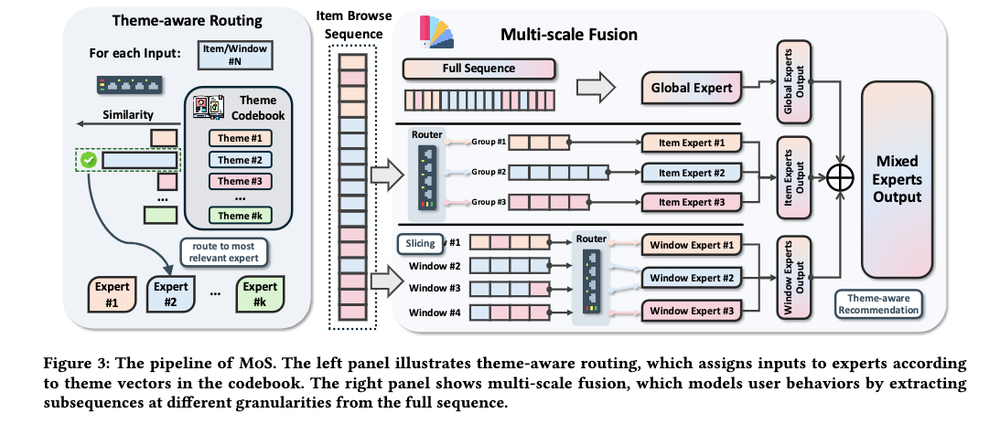

# Meta：序列聚类+MoE，搞定长序列推荐

关注我，每天为你精挑细选最优质、最新鲜的推荐算法paper，陪你一起保持进步、不断精进！

### 论文：Mixture of Sequence: Theme-Aware Mixture-of-Experts for Long-Sequence Recommendation
### 网址：https://arxiv.org/pdf/2604.20858
### 公司：Meta
### 思想：聚类
### 方向：长序列建模

## 解读：
提出了一个即插即用的长序列建模的模块，可无缝集成到任意序列推荐网络上，也可以新增到任何网络上。

### 动机
论文的关键出发点是观察到Session Hopping现象：用户的兴趣在长序列中具有三个特性——稳定性（短期内兴趣稳定）、不连续性（跨session急剧跳变）、重现性（过去的兴趣可能重新出现）。

实现方法：
### (1) 主题感知路由
目标：把原始长序列自适应拆分成多个子序列，每个子序列的item希望非常相似（比如同属于同一个topic），将其分配给相应的专家网络，每个专家只处理其中一个子序列。
路由分数的计算：维护一个可学习的主题codebook，用k-means初始化。每个序列item（其embedding）通过MLP投影到主题空间，与码本条目通过余弦相似度计算路由分数。实际操作中，不是top 1，而是通过采用稀疏激活（Top-k专家选择），激活最相关的几个专家。而码本用指数移动平均持续更新，保证主题中心稳定。

将所有序列item分配给不同的主题专家，每个主题专家是一个序列建模的模块，每个子序列分别用不同的主题专家计算了一个表征。对所有表征进行加权求和，获得一个最终表征。权重是完整序列的最新的item的路由分数。

### (2) 多尺度融合
在（1）中，每个专家专注一个主题的子序列，挖掘主题内深层语义模式。但是单纯拆分子序列可能丢失全局信息，因此引入另外两种专家互补：

* Global Expert：处理完整原始序列，捕捉全局长期偏好。
* 窗口专家：用滑动窗口捕捉短时局部动态，同时保持主题对齐。
融合方式：3种网络计算的表征，加权求和（可学习权重α），从而实现全局+主题+短时多视角建模。

训练策略：分成3个阶段渐进式训练（backbone预热 → 主题专家预热 → 联合优化），保证训练稳定。
* 第一阶段：不接入本文模块的情况下先训练整个backbone网络。
* 第二阶段： 冻结 embedding layer，只更新主题专家和窗口专家。 
* 第三阶段：联合微调所有参数。

### 离线效果
论文在三个数据集、四个backbone上测试，平均AUC提升0.68%，GAUC提升0.72%，且计算量只有传统MoE的约53%。

## 心得：
* 文章发现通过MLP作计算权重，效果并不理想，不如码本好。那种有很大数量专家网络，并且希望专家更加专注的负责某一方面的场景，都可以将MLP换成码本作为权重网络，看是否有效果提升。
* 码本条目是item embed聚类中心的centroid，本文是将序列item聚类到不同的cluster，不同的专家网络负责不同的cluster。

## 愚见

## 可信度：离线

## 推荐等级：有时间看看

**请帮忙点赞、转发，谢谢。欢迎干货投稿 \ 论文宣传\ 合作交流**

### 【铁粉】请入微信群，群内我会给出更深入的解读，还可以共同讨论技术方案、发招聘广告、内推和交友等。
* 铁粉标准：关注公众号一个月以上，且在公众号上累计15次互动（评论、爱心、转发）、或投稿1次、或打赏199，只欢迎技术同学。
* 入群方法：请您加个人微信lmxhappy，我拉您入群，请备注【公司】（只我个人看，不公开）。

## 推荐您继续阅读：

