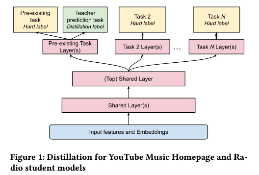

# YouTube Music新歌收听暴涨11%！零样本跨域知识蒸馏的工业级黑科技

关注我，每天为你精挑细选最优质、最新鲜的推荐算法paper，陪你一起保持进步、不断精进！

### 论文：Zero-shot Cross-domain Knowledge Distillation: A Case study on YouTube Music
### 网址：https://arxiv.org/pdf/2603.28994
### 公司：谷歌YouTube 团队
### 思想：迁移学习
### 方向：跨域学习+迁移学习

## 解读：
本文提出了一种零样本的跨域知识迁移方法。即把YouTube视频推荐的超大规模教师模型知识“蒸馏”到流量只有1/100的YouTube Music音乐推荐模型上，从而大幅提升低流量场景下的排序模型效果，同时保持极低的推理延迟。他们**彻底甩掉了长期依赖的视频采样数据**，训练更稳定，迭代更快。

简单来说，就是用teacher模型生成soft label作为一个student模型需要预测的新label，从而提升模型效果。具体的，
### （1）soft label获取
离线用teacher模型（youtube模型）为youtube music的样本生成soft label。因为特征是不相同的，缺失的特征就用全局统计均值或0来填补。

### （2）student模型改造
student和teacher有相同的目标，如CTR和消费时长，就在相关任务tower的output层输出1个变成输出2个，第一个输出是原本的输出，第二个输出就是预测teacher的soft label。损失函数用KL或者MSE，与主任务同权重，联合训练。

youtube music有两个主要的场景，包括首页推荐和电台。
* 首页推荐：跟youtube都有CTR和消费时长任务，所以都用soft label来提升训练。youtube没有对应任务，Discovery任务不蒸馏。
* 电台：youtube没有与之相同的任务，就引入了一个youtube有的“继续观看”任务，为之增加了一个tower，仅用音乐数据就能训练，不用于推理。

### **A/B**：对比的是只用纯YouTube Music数据集训练的模型
首页：互动+0.58%，discovery +1.12%，新歌收听 +11.39%
电台：互动 +0.70%，discovery +2.13%，新歌收听 +0.96%

## 心得：
* 本文的思路，很多人早就想过、局部组件也早就用了，但把这套“朴素”方法在如此大的跨域鸿沟下真正跑通、稳定上线、并公开分享生产数据，本文还是目前第一个公开的工业级案例。方法确实朴素得像“把大模型的脑子借给小模型用一下”，但在跨域 + 零样本 + 生产落地这个组合下，它目前还算得上“朴素却有效”的工业创新，而不是“大家都在用”的常规操作。
* 在此之前，youtube music用的是跨域数据增强，即从youtube抽样数据塞入到music的模型训练，这样做会让训练不稳定、数据依赖。
* 这个方法对短视频、新闻、电商、甚至任何低流量推荐场景都具有普适价值——大域知识终于可以干净地‘借’给小域了。

## 愚见
将改造的任务的塔称呼为Pre-existing Task Layer(s)，容易让人误解，很容易以为这是没做任何改动、纯原始的任务塔。

## 可信度：生产

## 推荐等级：有实践价值

**请帮忙点赞、转发、收藏！** **欢迎干货投稿 \ 论文宣传\ 合作交流**

### 【铁粉】请入微信群，群内我会给出更深入的解读，还可以共同讨论技术方案、发招聘广告、内推和交友等。
* 铁粉标准：关注公众号一个月以上，且在公众号上累计15次互动（评论、爱心、转发）、或投稿1次、或打赏199，只欢迎技术同学。
* 入群方法：请您加个人微信lmxhappy，我拉您入群，请备注【公司】（只我个人看，不公开）。

## 推荐您继续阅读：

