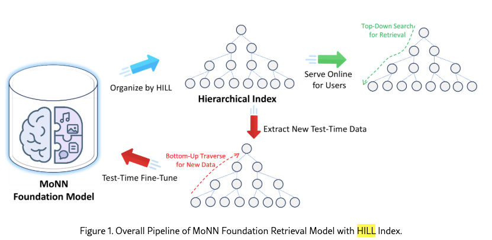

# Meta，树状聚类索引➕深度召回模型，业务指标+2.57%

关注我，每天为你精挑细选最优质、最新鲜的推荐算法paper，陪你一起保持进步、不断精进！

### 论文：Efficient Retrieval Scaling with Hierarchical Indexing for Large Scale Recommendation
### 网址：https://arxiv.org/html/2604.12965
### 公司：Meta
### 思想：通过残差量化实现了分层聚类
### 方向：深度召回

## 解读：
本文创建了一个端到端可训练的树状聚类索引，跟一个深度召回模型联合训练。因为物料量可能以亿计，所以必须引入索引，减少计算量，从而是让深度召回模型能够落地生产成为可能。简单来说，你可以这样想象：树的叶子结点是真实item，非叶子结点是其所有叶子子孙的一个代表item。有了这个想法，你就对本文方法明白了大半。训练的时候，将索引节点当作真实item一样处理；推理的时候，从同一层非叶子节点中找到top的节点，那么就缩小了召回范围，从而减小了计算量，加快了召回速度。

以 3 层树状索引为例：
第 1 层（根）：少量虚拟“粗粒度聚类中心”（index nodes）
第 2 层：中粒度虚拟节点，是学出来的“虚拟聚类中心”。
第 3 层（叶子）：真实 item（MoNN Item Tower 提前算好的 embedding）

可见，越下层，节点数量越大，这代表了从粗到细的一种聚类和分组。所有节点（包括索引节点和叶子结点），都和 MoNN 一起端到端训练（joint training）。叶子结点monn的学习过程很容易理解，不多讲。索引节点的学习过程比较特别，具体是：

### （1）索引节点的学习
把 item embedding 作为 query，学出来的索引节点 embedding 作为 key/value，做Cross-Attention，获得的伪表示。
把伪表示当作“虚拟 item”喂给 MoNN，，输出 preference logit，而使用对应的真实 item 的 hard label y 做监督。梯度会通过伪表示回传到索引节点的 embedding 上，从而间接优化 索引节点。
上层的索引结点会用大型的MoNN网络，下层的用medium、或者small的MoNN模型。

其中，特别的，用于粗层 I2IF的索引节点的虚拟特征，的计算方法：
* （1）延迟批量的、非实时的，在之前的Cross-Attention计算过程中，索引结点最像的一堆item，形成一个集合，且记录相应的attention值。
* （2）如果是onehot特征，选择 weighted_count 最高的那个特征值，就从embed layer查出来其embed；如果是multihot特征，就要查出weighted_count大于0的特征值的embed，再做pooling——一个聚类中心。
    * 某个特征值weighted_count的计算方法：该索引节点对应的真实item集合中，是所有拥有该特征的item的加权求和，权重就是attention值，获得一个统计数量weighted_count。

正如[HSNN](./hsnn.md)里描述的MoNN网络，真实item，除了用标签数据做多任务监督学习，还通过半监督学习用更多的无标签数据提升模型效果。本文是将索引节点像真实item一样做类似的训练。

### （2）Residual Quantization（残差量化）
上层的残差，减去伪表征，就是这层的残差。特别的，第一层的残差就是item embedding。
可见，层与层之间用残差传递，上层捕捉粗粒度语义，下层捕捉细粒度细节，保证信息不丢失。

对于某个真实item，在所有索引层的伪表示和，与其embed，有一个辅助任务——引入重建损失，强制分层索引在“压缩 + 重建”过程中尽量保留原始 item 的语义信息。

### （3）Test-Time Training（TTT）
训练好的索引中间节点，天然对应高质量的机器可读类别。把这些中间索引节点当成新“伪 item”，生成 <user, 索引节点> 训练对（经过简单过滤），在推理时对 MoNN 做无标签微调（test-time training）。该用户的本次推理不受影响，更新后的 MoNN 参数只用于当前这次用户请求的session内的后续打分。该用户的后续session不受影响，用的是全局的MoNN模型，对其他用户使用的模型也没有影响。

训练过程中，用到了温度调度器、FLOPs 正则（防聚类坍缩）等训练技巧，让索引学习更稳定。

### 推理
推理时，用 beam search（束搜索）从根节点快速往下走，只扩展最优的少量路径，最终只对几千个真实 item 完整跑 MoNN + OverArch。
具体的，检索过程是从根节点（最粗粒度的 index node）开始，用 MoNN Large 快速打分，从上往下，逐层遍历。

每层处理完后，只保留 top-k 个最优的索引节点作为下一层的候选。最终只有极少量路径到达叶子节点（真实 item），这些 item 才会完整跑 OverArch 打分。

### A/B：
Meta广告：2层索引的MoNN比基础MoNN，最高提升+2.57%在线业务指标。已支持 Facebook + Instagram 亿级用户每日广告推荐。

## 心得：
* HILL 的分层索引本质上就是把 RQ-VAE 那种“多层残差聚类中心”的思想，迁移到了推荐系统的可学习索引上，从而实现了“粗层快速过滤 + 细层精确打分”。
* 在GR里会建一棵树加快decode过程，本文也是类似聚类分组，但是不同的是本文父亲子孙关系是动态的，推理、训练的时候，都是不固定的。

## 可信度：生产

## 推荐等级：有实践价值

**请帮忙点赞、转发，谢谢。欢迎干货投稿 \ 论文宣传\ 合作交流**

### 【铁粉】请入微信群，群内我会给出更深入的解读，还可以共同讨论技术方案、发招聘广告、内推和交友等。
* 铁粉标准：关注公众号一个月以上，且在公众号上累计15次互动（评论、爱心、转发）、或投稿1次、或打赏199，只欢迎技术同学。
* 入群方法：请您加个人微信lmxhappy，我拉您入群，请备注【公司】（只我个人看，不公开）。

## 推荐您继续阅读：

