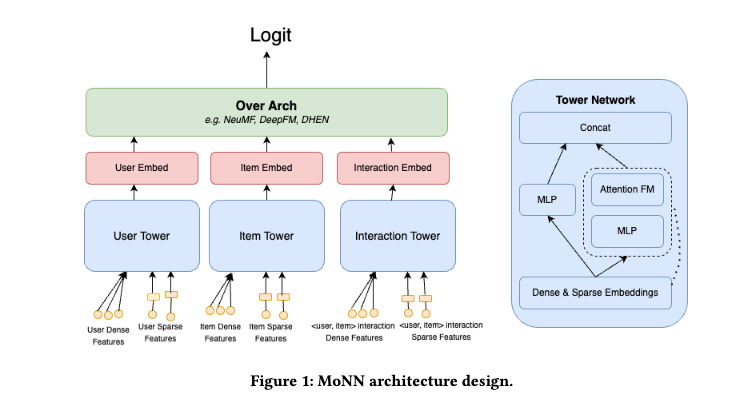

# Meta, 深度召回的业务指标+3%

关注我，每天为你精挑细选最优质、最新鲜的推荐算法paper，陪你一起保持进步、不断精进！

### 论文：Hierarchical Structured Neural Network: Efficient Retrieval Scaling for Large Scale Recommendation
### 网址：https://arxiv.org/pdf/2408.06653
### 公司：Meta
### 思想：利用 item 聚类中心替代具体 item
### 方向：深度召回

## 解读：
提出了一种“三塔+fusion head”的深度召回模型MoNN。传统 Two-Tower 检索模型在召回阶段只能靠 user embedding 和 item embedding 做点积，交互能力非常有限。把 Ranking 阶段的深度 user-item 交叉能力高效搬到 Retrieval 阶段，让召回既快又强。

### 架构：
* User Tower：只处理 user-only 特征，输出 user embedding（查询时只算一次，后续所有 item 复用）。
* Item Tower：只处理 item-only 特征，异步更新。
* Interaction Tower（最大亮点）：专门处理 ⟨user, item⟩ 交叉特征。
* fusion head：坐在上面三塔之上，融合三者输出，生成多个 任务相关的logit（click logit、转化logit等）。

三个 Tower 共用 Tower Network（MLP + AttentionFM 层），fusion head可选用 DHEN、DeepFM 等融合模型。

本模型的亮点是Interaction Tower，它的的关键是 Inverted Index Based Interaction Features。具体的，
### （1）item 侧特征（category、tag 等）提前建好倒排索引，key是这些特征值，value是item set，以及根据item embed聚合而成的embed，聚合方法可以是mean或者sum。其中，item embed是经过item tower获得的。

### （2）User Tower 已经算好 user 侧特征 用户最近 engaged 的 categories = [“sports”, “outdoors”, “fashion”]（这是一个 list 或 embedding 表示）

### （3）把 user 特征直接写成 query Interaction Tower 把这个 list 当作 query，并行去倒排索引里查找：
* 查询 “sports” → 拿到该 category 的预聚合 dense vector。就是所有item经过item塔获得的embed的聚合向量。
* 查询 “outdoors” → 拿到 coutdoors的预聚合 dense vector
* 查询 “fashion” → 拿到 cfashion预聚合 dense vector

### （4）立即做聚合（Pooling / Aggregation），会瞬间把多个向量聚合成一个固定维度的向量。pooling可以是mean或者sum；aggregation可以用轻量的attention网络。

效果：把暴力交叉的计算量从 O(user × item) 降到一次 query + 轻量聚合，让复杂交叉在亿级物品库上实时可行。

### 训练：
包括两种学习，
* 多任务监督学习：点击/转化作正标签，曝光未点击/转化（impressions，下采样后）作负样本。它们都是有标签数据。
* 半监督学习：使用大量无标签数据（主要来自全量曝光数据或ranking阶段未曝光数据），通过self-distillation做无监督损失，实现去偏 + 正则化。其中，self-distillation有两种可行的方案：
    * Snapshot：每隔几分钟生成新 snapshot，把snapshot作为teacher，当前模型作为student，teacher生成的soft label指导student，计算交叉熵损失。
    * EMA：就是过去多个版本的模型的weights做移动平均的model作为teacher，其它同Snapshot方式。

有标签数据同时计算这两种损失；无标签数据只做半监督学习。

### 线上效果
MoNN作为基础模型在Meta广告系统部署 2 年+，线上 A/B 测试相比传统 Two-Tower 带来 +2.57% 业务指标提升。

## 心得：
* 直接放弃了“augmentation + contrastive”的老路，改用distillation + unlabeled data 来实现类似（甚至更好）的去噪/正则效果。
* 让同行看到meta是如何使用全量曝光数据提升模型的。
* 这是2024年的论文，讲解的原因是为最近的另外一篇meta论文的解读做铺垫。

## 愚见
有的组件起的名字是组织内部的名字，业界并不流行，增加了读者的负担。

## 可信度：生产

## 推荐等级：有实践价值

**请帮忙点赞、转发，谢谢。欢迎干货投稿 \ 论文宣传\ 合作交流**

### 【铁粉】请入微信群，群内我会给出更深入的解读，还可以共同讨论技术方案、发招聘广告、内推和交友等。
* 铁粉标准：关注公众号一个月以上，且在公众号上累计15次互动（评论、爱心、转发）、或投稿1次、或打赏199，只欢迎技术同学。
* 入群方法：请您加个人微信lmxhappy，我拉您入群，请备注【公司】（只我个人看，不公开）。

## 推荐您继续阅读：

