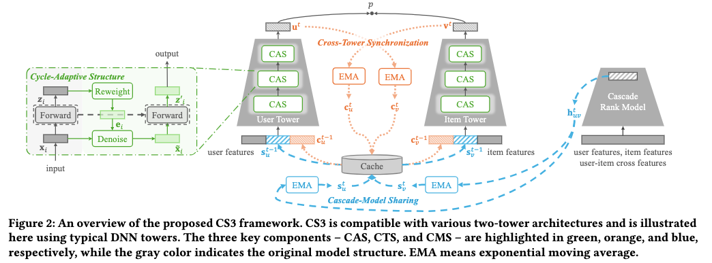

# 快手，双塔召回，广告收入最高+8%

关注我，每天为你精挑细选最优质、最新鲜的推荐算法paper，陪你一起保持进步、不断精进！

### 论文：CS3: Efficient Online Capability Synergy for Two-Tower Recommendation
### 网址：https://arxiv.org/pdf/2604.22761v1
### 公司：快手
### 思想：聚类、上下游一致、知识蒸馏
### 方向：双塔召回

## 解读：
提出了一个通用、可插拔的框架，可无缝集成到任意两塔架构（如 DSSM、IntTower 等）中，通过三个模块实现“能力协同”，分别是塔内提升、塔间协同、下游复用等3方面的工作，对应3个创新做法。

### （1）循环自适应结构——塔内提升
让每个塔自己感知自己的输出，实现特征去噪和自我修订。即在user塔、item塔，堆叠了多层CAS模块层，而不是普通的dense层。

CAS的实现流程：
1. 普通前向：输入x经过一层dense层获得z。
2. 自适应重加权：z经过另外一层dense层获得e。
3. 去噪：输入x与2*e做hadmard积。
4. 循环前向：输入到dense层（与普通前向的dense层共享weights），获得输出，作为下一层输入。

可以将1、2看作是gate network，类似于pepnet的epnet。区别是gate network里用到了共享weights的下游dense层。epnet是在做去噪，本文也是在做。
。
效果：显著提升单塔的表示质量和鲁棒性，相当于给每个塔加了一个“自检机制”。

### （2）跨塔同步——塔间协同
让用户塔和物品塔实时感知对方，解决表示对齐问题。

一个user，其互动过的正样本 item embeddings 的动态聚类中心，作为该user在user塔的额外输入。相似的，一个item，与其有正向互动的user embedding的 的动态聚类中心，作为该item在item塔的额外输入。

计算方法就是只在正样本，使用指数移动平均计算指数移动平均值。

它本质上在为 user tower 提供一个“我过去喜欢过的物品长什么样” 的实时摘要信号。item侧也类似，喜欢该item的user长什么样子。

### （3）级联模型共享——跨阶段复用
让两塔模型直接借力下游排序模型的知识，解决跨阶段不一致。

排序模型针对具体的 (user, item) 对算出一个强表征，把它“注入”到 user 的持久化表征和item 的持久化表征中。具体的，通过移动平均更新，分别更新user、item等两个表征。

以后每次用户来请求时，user 塔直接把上一次更新好的表征当作额外输入，相当于 user 塔“偷学”了排序模型对该用户历史的强偏好知识。item塔也如此这般，用item的该表征，作为额外输入。

此处，正负样本都用，它记录了“排序模型认为这个 user 过去在哪些 item 上打过高分、在哪些 item 上打过低分”的综合信号，代表了排序模型眼中的用户偏好原型。塔直接把这个向量当作额外输入，相当于“偷学”了更强排序模型的表示能力。

### A/B：
快手广告系统三大场景，最高提升 8.36% 广告收入，同时保持毫秒级延迟。

## 心得：
* 塔间助力、下游复用，都是将能获得的“知识”都用起来，提升召回模型的效果。
* 塔间助力、下游复用，就是聚类思想的一次有效实践，不将本次user与item交互作为交叉助力，而是长期积累的互动信息的聚类中心，相互助力。
* 下游复用，是下游复杂排序模型的知识，强行拿到召回用。

## 可信度：生产

## 推荐等级：有实践价值

**请帮忙点赞、转发，谢谢。欢迎干货投稿 \ 论文宣传\ 合作交流**

### 【铁粉】请入微信群，群内我会给出更深入的解读，还可以共同讨论技术方案、发招聘广告、内推和交友等。
* 铁粉标准：关注公众号一个月以上，且在公众号上累计15次互动（评论、爱心、转发）、或投稿1次、或打赏199，只欢迎技术同学。
* 入群方法：请您加个人微信lmxhappy，我拉您入群，请备注【公司】（只我个人看，不公开）。

## 推荐您继续阅读：

