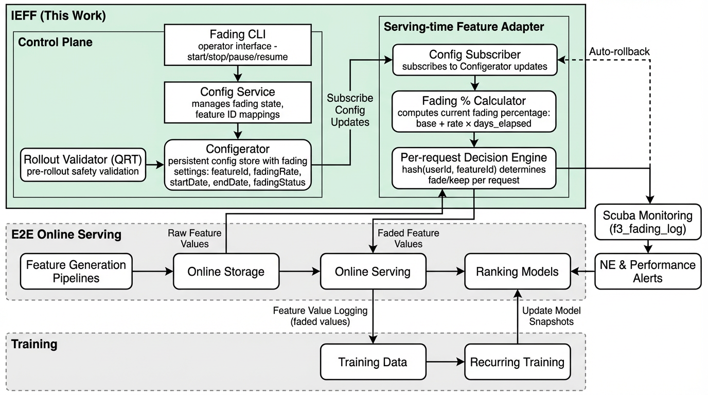

# Meta，特征下线的优雅方法，又快又稳

关注我，每天为你精挑细选最优质、最新鲜的推荐算法paper，陪你一起保持进步、不断精进！

### 论文：Intelligent Elastic Feature Fading: Enabling Model Retrain-Free Feature Efficiency Rollouts at Scale
### 网址：https://arxiv.org/html/2605.00324
### 公司：Meta
### 思想：在 serving 阶段对特征 coverage / 分布进行弹性渐变（fading），让模型借助持续训练管道自然适应，从而实现"免重训"的特征下线、替换或缩量上线。
### 方向：ML Infra / 特征运维 / 特征生命周期管理

## 解读：
本文提出了一种将损失降到最低的下线特征的新方法。

### 背景：
排序模型通常依赖几千个特征，这些特征来自不同时间窗口（当天、过去7天、30天等）。下线一个特征，必须重新并行训练整个模型，等AUC、loss等指标跟老模型齐平，才能将其上线。这个过程，浪费了大量的计算资源，很可能无法追赶上老模型，或者很久才能追赶上。这是因为这种直接“暴力删特征”会导致特征分布剧烈漂移，可能引起模型效果的大幅下降。

### 方法
本文在不改上游特征管道、不重训模型的情况下，实现特征的渐进式下线。方法很简单，就是从“暴力的直接删除”改成“慢慢渐进衰减”，让特征覆盖率或分布每天只小步变化（如1%~10%/天），模型通过日常持续训练自然适应，从而实现无需重训模型的下线/迁移。

有两种衰减方式：
* 特征覆盖衰减：逐渐降低特征被采样的比例（比如从100%降到0%）。主要用于特征的删除。
* 分布衰减：通过缩放、裁剪、值替换等方法，逐渐调整特征的数值分布，将分布区间变得越来越小。主要用于特征的降权，而不是删除。

训练-服务一致性：衰减后的特征值会被完整记录到训练日志，确保训练和推理保持一致。

### 安全
方法虽然简单，但是为了保证整个系统的稳定性，配备了一套完备的训练、监控和回滚支持系统：
* 完备的验证：每次上线前，必须先在离线 + 受控在线环境里跑完整渐进衰减测试，确认Normalized Entropy的变化和业务 KPI 都在安全阈值内，才能正式上线。一旦任意指标超过预设阈值，系统自动暂停上线或触发告警。
* 配置化一键回滚：所有参数（起始时间、衰减速率、目标状态）全部通过集中控制平面配置。回滚操作就是改一个配置，立刻全局生效（秒级恢复到 100% 原始覆盖率），无需改代码、无需重训、无需改特征管道。任何时刻都可以暂停、加速、减速或完全回滚，整个过程对模型和上游管道零侵入。

### 效果
A/B实验：暴力删Top 50特征，性能下降了0.83%；而渐进衰减，仅下降了0.37%（改善55%）。
2024年–2026年上线，成功衰减 275个特征，分14批上线，避免了约 140次重训，节省约 15% 的基础设施成本，上线速度提升5倍。相当于平均每月下线~10个特征，过去这种规模的清理几乎不可能做到。

## 心得：
* 有痛点，就想办法解决。方法不在于简单与否，只要解决了，就有成果。
* 有人做了类似的简单工作，但是拿到了不小的成果，但是觉得不值得将其写成paper，是因为他没有看到工作的广泛价值。

## 愚见

## 可信度：生产

## 推荐等级：有实践价值

### 图1：IEFF 系统架构
Control Plane 下发 fading 配置，serving-time Feature Adapter 渐进调整特征 coverage，调整后的特征值同时进入在线推理与持续训练管道。

**请帮忙点赞、转发，谢谢。欢迎干货投稿 \ 论文宣传\ 合作交流**

### 【铁粉】请入微信群，群内我会给出更深入的解读，还可以共同讨论技术方案、发招聘广告、内推和交友等。
* 铁粉标准：关注公众号一个月以上，且在公众号上累计15次互动（评论、爱心、转发）、或投稿1次、或打赏199，只欢迎技术同学。
* 入群方法：请您加个人微信lmxhappy，我拉您入群，请备注【公司】（只我个人看，不公开）。

## 推荐您继续阅读：

