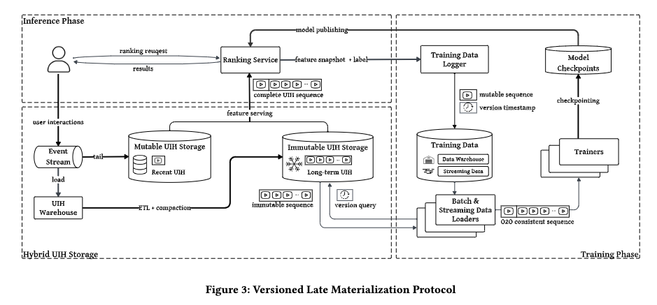

# Meta, 推荐团队的工程架构很给力

关注我，每天为你精挑细选最优质、最新鲜的推荐算法paper，陪你一起保持进步、不断精进！

### 论文：Versioned Late Materialization for Ultra-Long Sequence Training in Recommendation Systems at Scale
### 网址：https://arxiv.org/pdf/2604.24806
### 公司：Meta 
### 思想：计算替代存储
### 方向：推荐系统基础设施

## 解读：
本文将推理时候存储样本用于后续的训练，变成推理时候保存版本信息，训练时候，根据版本信息，从一个存储里按需重建。

### 问题背景
在深度学习推荐系统中，推理和训练要保持一致，推理的时候用户的完整交互历史的完整特征和其它特征，预先保存下来，作为训练用的样本。这带来一个核心问题：**当序列长度从几百扩展到数千时，数据基础设施的资源消耗会远远超过GPU训练的需求**。而且，不同租户之间重复存储同一份数据，或者不同长度的序列数据。

### 核心创新：
* 存储：创建一个不可变存储层，把历史按起始时间戳分段存储，支持高效范围扫描。一个用户的历史只存一份数据，多租户并行访问同一份数据，无重复存储。
* 推断：只记录可变部分（最近实时事件）+ 不可变部分的版本指针（包括start_ts、end_ts、length、checksum 等元数据）。
* 训练：用版本指针 + 时间谓词（timestamp ≤ request_time）即时重建完整序列，天然防止未来泄漏。

这一套重建逻辑，可以同时服务实时训练和离线训练。

当听到，训练时候不能直接使用推理缓存的样本，而是重建样本，就会犯嘀咕，会不会因此增加计算，延迟训练的？这个是有解的，下面的技术把重建延迟完全掩盖掉，训练吞吐仍由 GPU 计算主导。
* 混合存储：可变层（mutable，实时 KV） + 不可变层（immutable，每天压缩成列式、读优化，支持多维投影下推 projection pushdown）。
* 读优化不可变层：列式编码 + 投影下推，让不同租户模型只读自己需要的列和长度，消除多租户惩罚。
* 训练时优化：解耦预处理、流水线 I/O 预取、数据亲和性调度。

## 心得：
* 这是一篇**系统设计与工程实践的范例**。不是纯算法创新，而是用巧妙的架构设计解决生产规模的基础设施困境。
* "延迟物化"的思想很值得借鉴——**不在关键路径上做不必要的预计算**，而是推迟到真正需要时再做，类似数据库的延迟求值。
* 版本化机制解决了在线离线一致性的经典难题，特别是在多租户环境下，这个价值巨大。
* 这类基础设施工作的复杂性往往被低估，但对业务的影响可能比单个算法改进更大——能支撑更长的序列 = 更好的模型效果。

## 可信度：生产

## 推荐等级：有实践价值

**请帮忙点赞、转发，谢谢。欢迎干货投稿 \ 论文宣传\ 合作交流**

### 【铁粉】请入微信群，群内我会给出更深入的解读，还可以共同讨论技术方案、发招聘广告、内推和交友等。
* 铁粉标准：关注公众号一个月以上，且在公众号上累计15次互动（评论、爱心、转发）、或投稿1次、或打赏199，只欢迎技术同学。
* 入群方法：请您加个人微信lmxhappy，我拉您入群，请备注【公司】（只我个人看，不公开）。

## 推荐您继续阅读：
